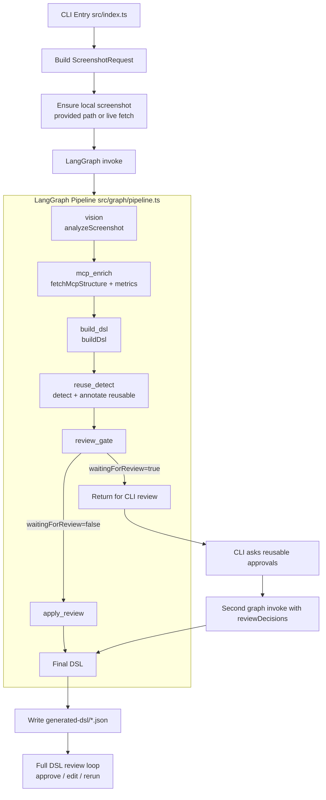
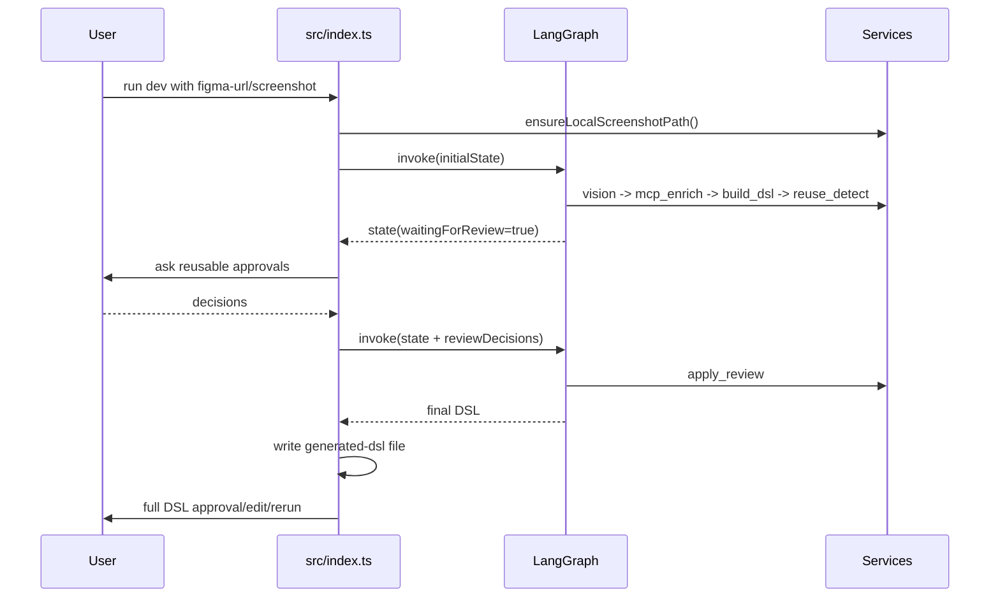

# thesis-demo

LangGraph MVP for Figma screenshot -> DSL pipeline with unified enriched node format:

1. Analyze screenshot semantics first (LLM stage).
2. Use **enriched Figma nodes** (unified format with full style/layout/interaction data).
3. Fill structured values into hierarchical DSL.
4. Mark reusable parts in DSL and gate by CLI human review.

## 🎯 新架构亮点

- ✅ **统一数据格式**：在线和离线使用相同的 enriched nodes JSON
- ✅ **更丰富的数据**：包含完整样式、布局、交互信息
- ✅ **简化架构**：移除 MCP adapter 依赖，直接调用 Figma API
- ✅ **一套 enrich 逻辑**：`enrichFigmaNodes()` 统一处理所有数据源

详见：[Enrich Architecture 文档](docs/ENRICH_ARCHITECTURE.md)

## Quick Start

### 离线模式（推荐用于开发）

```bash
npm install

# 1. 运行 enrich 脚本生成增强节点数据
npm run build
npx tsx scripts/enrich-offline-nodes.ts

# 2. 运行 Pipeline（使用离线数据）
npm run dev -- --offline
```

### 在线模式（需要 Figma API token）

```bash
npm install

# 配置环境变量
export FIGMA_API_KEY=your_figma_pat

# 运行 Pipeline（自动从 Figma API 获取并 enrich）
npm run dev -- "https://www.figma.com/file/xxx/yyy?node-id=1-2"
```

Arguments:

- `screenshot-path` (optional): local screenshot generated from Figma.
- `mcp-structure-json-path` (optional): exported MCP structure JSON.
- `figma-url` (optional): Figma file/frame URL, used by MCP adapter flow.

If `screenshot-path` is omitted and `figma-url` is provided, the CLI auto-renders and saves a screenshot to `generated-screenshots/`.

Strict live mode (no local/mock fallback):

```bash
npm run dev -- --strict-live "https://www.figma.com/file/xxx/yyy?node-id=1-2"
```

When `--strict-live` is enabled:

- `figma-url` is required.
- screenshot must be fetched from live Figma.
- compact structure must come from live Figma.
- synthetic metric fallback is disabled.

Environment for live Figma pull:

```bash
export FIGMA_API_KEY=your_figma_pat
export FIGMA_FILE_KEY=your_figma_file_key # optional if figma-url is provided
export FIGMA_OAUTH_TOKEN=your_oauth_token # optional, used if provided
```

This project now uses:

- **Unified enriched node format** for all data sources (online/offline).
- **Direct Figma API calls** (`/v1/files/{key}/nodes`) with full geometry and style data.
- **`enrichFigmaNodes()`** service for consistent data transformation.
- `@langchain/langgraph` for workflow orchestration.

## Architecture Diagram



### Sequence (Human-in-the-loop)



## CLI Review Flow

- Every conversion writes a new DSL file to `generated-dsl/`.
- Detected reusable modules are marked with `reusable: true`.
- CLI first asks reusable component approvals.
- CLI then asks full DSL approval.
- If full DSL is rejected, you can:
  - edit the generated file manually and continue review, or
  - re-run conversion to generate a new DSL file (with user feedback injected).
- Rerun feedback history is stored in DSL `metadata.rerunFeedbacks`.
- Rule hits are stored in DSL `metadata.appliedFeedbackRules`.

### Feedback-driven Rule Engine (current MVP)

When user rejects full DSL and chooses rerun, feedback text can drive structural adjustments:

- `间距减小` / `reduce gap`: reduce all `layout.gap` by 25%.
- `间距增大` / `increase gap`: increase all `layout.gap` by 25%.
- `padding减小` / `reduce padding`: reduce all `layout.padding` by 20%.
- `按钮左对齐` / `button left`: align button-containing modules to `start`.
- `按钮右对齐` / `button right`: align button-containing modules to `end`.
- `模块拆分` / `fine-grained module`: wrap non-module children into sub-modules.

## DSL Example

```json
{
  "type": "Page",
  "layout": {
    "padding": 24,
    "gap": 16,
    "direction": "vertical"
  },
  "children": [
    {
      "type": "Module",
      "name": "SearchBar",
      "layout": {
        "direction": "horizontal",
        "align": "center",
        "gap": 12
      },
      "children": [
        {
          "type": "Input",
          "ref": "antd.Input",
          "props": {
            "placeholder": "Search"
          }
        },
        {
          "type": "Button",
          "ref": "antd.Button",
          "props": {
            "text": "Go",
            "type": "primary"
          },
          "interactions": [
            {
              "trigger": "onClick",
              "action": "OPEN_MODAL",
              "target": "confirm_modal"
            }
          ]
        }
      ]
    }
  ]
}
```

## Next Step Suggestions

- Replace `src/services/vision-analyzer.ts` with real multimodal LLM provider.
- Replace `src/services/figma-api.ts` with your company MCP/orchestration API bridge.
- Add page-level interaction DSL (routing, async loading, modal flow, list pagination).
- Connect to Playwright comparison and auto-fix loop in phase-2.


flowchart TD
  U[User / CLI Input] --> A[src/index.ts]
  A --> A1[Parse args<br/>screenshotPath / figmaUrl / strictLive]
  A1 --> A2[ensureLocalScreenshotPath<br/>src/services/mcp-figma-client.ts]
  A2 --> B[createPipeline + invoke<br/>src/graph/pipeline.ts]

  subgraph LG[LangGraph Workflow]
    direction TB
    N1[vision<br/>analyzeScreenshot<br/>src/services/vision-analyzer.ts]
    N2[mcp_enrich<br/>fetchMcpStructure + convertMcpStructureToMetrics<br/>src/services/figma-api.ts]
    N3[build_dsl<br/>buildDsl + applyFeedbackRules<br/>src/services/dsl-builder.ts + feedback-rule-engine.ts]
    N4[reuse_detect<br/>detectReuseCandidates + annotateReuseCandidates<br/>src/services/reuse-detector.ts]
    N5[review_gate]
    N6[apply_review<br/>applyReuseApprovals]
    N1 --> N2 --> N3 --> N4 --> N5
    N5 -->|waitingForReview=true| E1[END first pass]
    N5 -->|waitingForReview=false| N6 --> E2[END final]
  end

  B --> N1
  E1 --> C[CLI reusable review<br/>collectReviewDecisions]
  C --> D[Second invoke with reviewDecisions]
  D --> N1
  E2 --> F[writeDslFile<br/>generated-dsl/*.json]
  F --> G[Full DSL Review Loop<br/>approve / edit / rerun]
  G -->|rerun with feedback| A
  G -->|approved| H[Done]


npm run dev -- "https://www.figma.com/design/zAiOdDIvEpBjoedlsRP6qC/Pamela-Edward--Community-?node-id=34-12&t=fkXls5YYOfrXZL34-0"